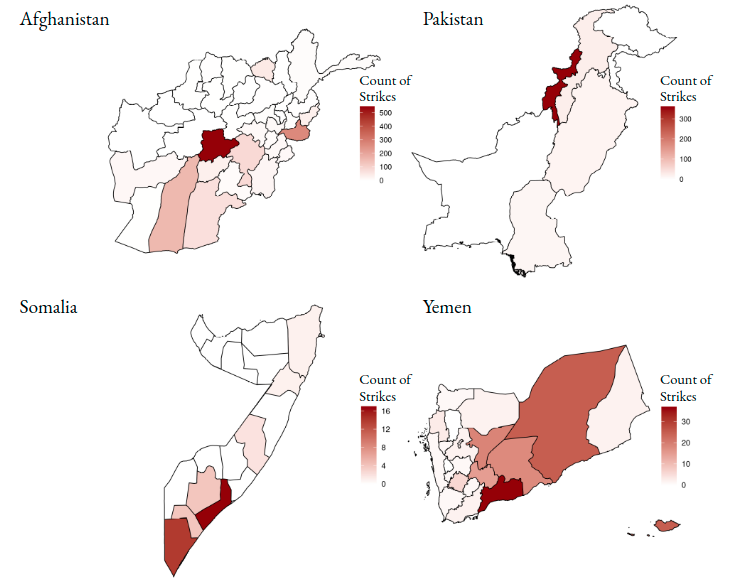

# Airstrikes and counterinsurgency

with Colin Tucker

forthcoming *Security Studies*

When availible online, the permanant link is [http://dx.doi.org/10.1080/09636412.2022.2065926](http://dx.doi.org/10.1080/09636412.2022.2065926)

Are airstrikes an effective counterinsurgency tool? Or do they create blowback, increasing insurgent forces?

